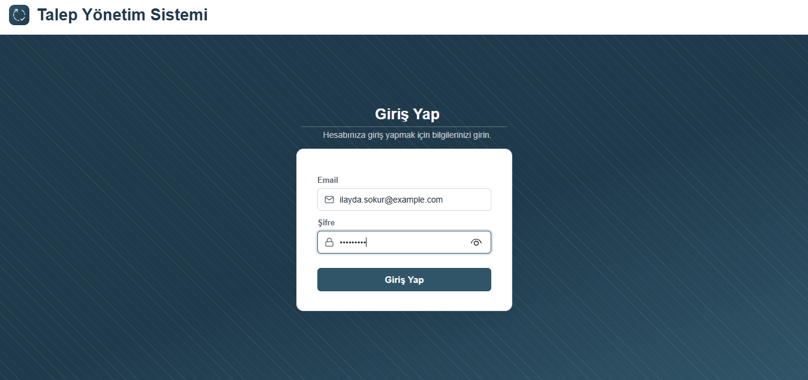
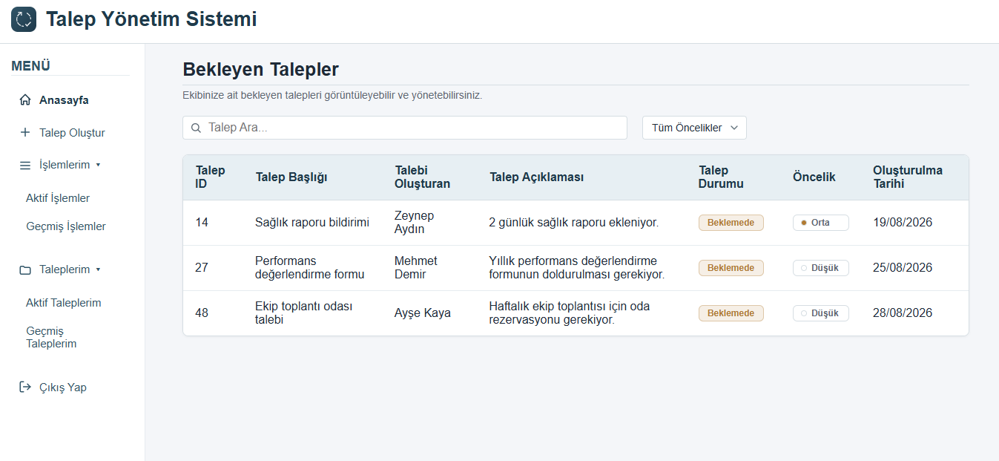
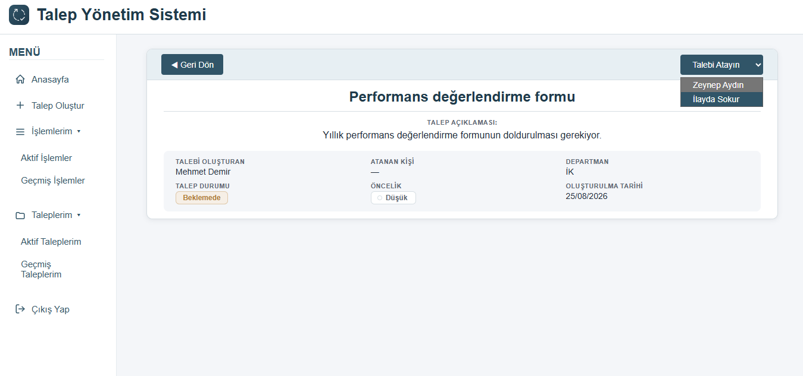
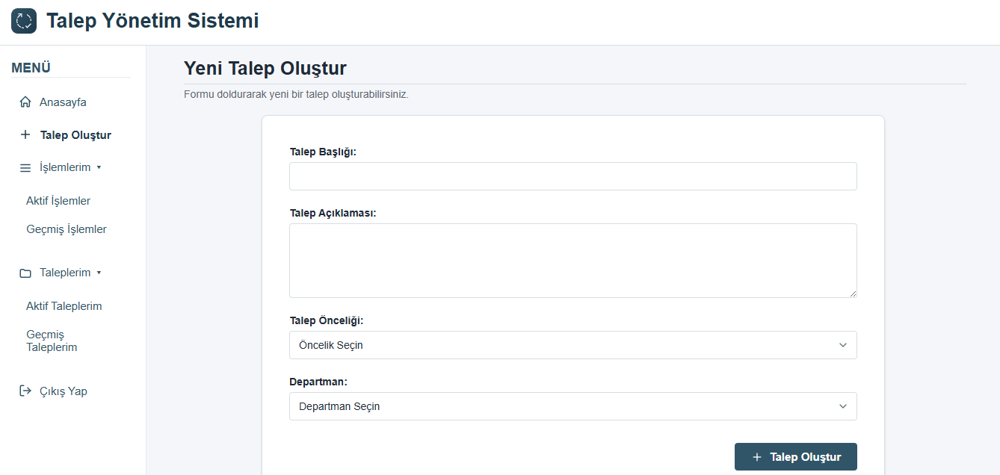

# Talep Yönetim Sistemi

Bir şirket içinde çalışanların departmanlara (IT, İK, Finans) talep açabildiği, bu taleplerin ilgili departman çalışanlarına atanıp takip edilebildiği full-stack bir web uygulaması. Gerçek şirketlerdeki "ticket sistemi" (Jira, Zendesk vb.) mantığının küçük ölçekli bir versiyonu — öğrenme amaçlı bir staj/geliştirme projesi olarak inşa edildi. JWT tabanlı kimlik doğrulama ile korunuyor; her kullanıcı sadece kendi departmanına ait talepleri görüp yönetebiliyor.

## Ekran Görüntüleri

**Giriş Ekranı**


**Anasayfa — Bekleyen Talepler**


**Talep Detayı**


**Talep Oluştur**


## Kullanılan Teknolojiler

**Backend:** ASP.NET Core Web API (.NET 9), Entity Framework Core, SQLite, JWT (JSON Web Token) tabanlı kimlik doğrulama

**Frontend:** React (Vite), React Router

## Özellikler

- Talep oluşturma, departman çalışanına atama, tamamlama
- Departman ve önceliğe göre filtreleme, arama
- Rol bazlı görünümler ("Taleplerim", "İşlemlerim" — aktif/geçmiş ayrımıyla)
- Talep üzerinde yorum/mesajlaşma
- Kurumsal, tema tabanlı (CSS custom properties) responsive arayüz
- JWT tabanlı kimlik doğrulama: login, korumalı endpoint'ler, korumalı route'lar, logout

## Proje Yapısı

```
backend/RequestManagement.API/
  Controllers/     → RequestController, EmployeeController, DepartmentController, CommentController, AuthController
  models/          → Request, Employee, Department, Comment + DTO sınıfları
  data/            → AppDbContext
  Migrations/      → EF Core migration geçmişi
  Program.cs       → servis kayıtları, middleware, seed (test) verisi

frontend/src/
  pages/           → Home, CreateRequest, MyRequests, MyActions, RequestDetail, Login
  components/      → ProtectedRoute
  App.jsx          → layout, routing, sidebar
  labels.js        → Türkçe görünen metin karşılıkları, ortak sabitler ve yardımcı fonksiyonlar (authHeaders, getCurrentUser)
  App.css          → merkezi tema/tasarım sistemi
```

## Kurulum ve Çalıştırma

### Backend

```
cd backend/RequestManagement.API
dotnet restore
dotnet ef database update
dotnet run
```

`dotnet ef database update`, `Migrations/` klasöründeki geçmişe göre SQLite veritabanını (`requests.db`) oluşturur/günceller. İlk çalıştırmada `Program.cs`'teki seed bloğu devreye girer ve test verisi (3 departman, 5 çalışan, 51 mock talep) otomatik oluşturulur.

Backend varsayılan olarak `http://localhost:5145` üzerinde çalışır.

### Frontend

```
cd frontend
npm install
npm run dev
```

Frontend varsayılan olarak `http://localhost:5173` üzerinde çalışır (backend'in CORS ayarında bu adrese izin verilmiştir).

## API Endpoint'leri

`/api/auth/login` dışındaki tüm endpoint'ler `[Authorize]` ile korunuyor — geçerli bir JWT token gerektiriyor.

| Metot | Adres | Açıklama |
|---|---|---|
| POST | `/api/auth/login` | Email + şifre ile giriş yap, JWT token döner |
| GET | `/api/request` | Tüm talepleri listele |
| GET | `/api/request/{id}` | Tek bir talebi getir |
| POST | `/api/request` | Yeni talep oluştur |
| PATCH | `/api/request/{id}/assign` | Talebi bir çalışana ata |
| PATCH | `/api/request/{id}/complete` | Talebi tamamlandı olarak işaretle |
| GET | `/api/department` | Departmanları listele |
| GET | `/api/employee` | Tüm çalışanları listele |
| GET | `/api/employee/{departmentId}` | Bir departmanın çalışanlarını listele |
| GET | `/api/comment/{requestId}` | Bir talebin yorumlarını listele |
| POST | `/api/comment` | Yeni yorum ekle |

## Veri Modeli

- **Request** → bir `Department`'a bağlı (foreign key)
- **Employee** → bir `Department`'a bağlı, `PasswordHash` alanıyla login'e hazır
- **Comment** → bir `Request`'e bağlı
- **Department** → birden çok `Employee` ve `Request`'i barındırır

## Yapılacaklar

**Güvenlik**
- [ ] Talep atama/tamamlama endpoint'lerinde departman sahiplik kontrolü — şu an `[Authorize]` sadece "giriş yapmış mı" diye bakıyor, "bu talep onun departmanında mı" diye bakmıyor. Teorik olarak giriş yapmış herhangi biri, kendi departmanı dışındaki bir talebi de atayabilir/tamamlayabilir.
- [x] Token süresi dolduğunda/geçersiz olduğunda kullanıcıyı otomatik `/login`'e yönlendirme — `labels.js`'teki `apiFetch` yardımcı fonksiyonu tüm istekleri sarmalıyor, 401 cevabında token'ı silip yönlendiriyor; sayfalar da render sırasında `currentUser` null gelirse aynı şekilde yönlendiriyor.

**Diğer**
- [ ] Talep/yorum/çalışan silme (DELETE) işlemleri
- [ ] Çalışan/departman yönetim ekranı (yeni çalışan ekleme, şu an sadece seed veriyle geliyorlar)
- [ ] Loading göstergesi ve daha açıklayıcı hata mesajları
- [ ] "Talebi Tamamla" gibi geri alınamaz işlemler için onay adımı
